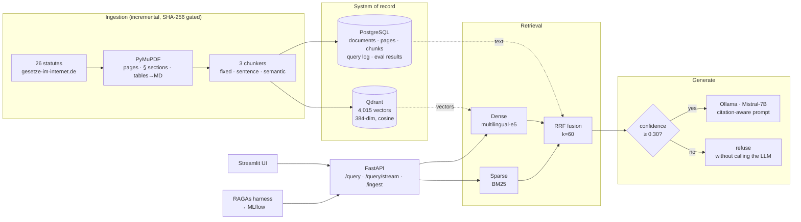

# RAGBuilder — Retrieval-Augmented QA over German Labour Law

A production-shaped RAG system over **26 German federal labour statutes**, running
**entirely on local models**. Hybrid retrieval (dense + BM25 fused with Reciprocal Rank
Fusion) and citation-grounded generation with an explicit refusal path.

No document and no question ever leaves the machine — which for a German client under
GDPR is the difference between a project that ships and one that dies in a data
protection review.

---

## Architecture

**PostgreSQL is the system of record; Qdrant is derived state.** Changing the embedding
model or the chunking strategy means dropping the collection and rebuilding it — which
must not mean re-parsing 26 PDFs. The vector payload carries a 300-character preview for
rendering a citation without a round trip, and nothing more.

---

## The corpus

26 federal statutes from **gesetze-im-internet.de**, the Federal Ministry of Justice's
official publication service — free of copyright under § 5 UrhG.

`KSchG` · `ArbZG` · `BUrlG` · `TzBfG` · `EntgFG` · `MuSchG` · `BEEG` · `AGG` · `BetrVG` ·
`ArbSchG` · `MiLoG` · `NachwG` · `BBiG` · `JArbSchG` · `PflegeZG` · `FPfZG` · `ArbnErfG` ·
`AÜG` · `TVG` · `ArbGG` · `BetrAVG` · `BDSG` · `SchwarzArbG` · `BPersVG` · `ArbPlSchG` ·
`GeschGehG`

Chosen over annual reports or arXiv papers for three reasons that make it a *harder* and
more revealing test: the text is German while questions may be either language; every
provision is numbered so citations are checkable by hand; and answers are precise
("24 Werktage") so a hallucination is unambiguous rather than a plausible summary.

An English fallback corpus (`arxiv_nlp`) is registered for demos:
`make ingest CORPUS=arxiv_nlp`.
