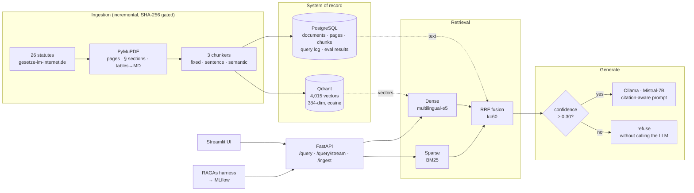

# RAGBuilder — Retrieval-Augmented QA over German Labour Law

A production-shaped RAG system over **26 German federal labour statutes**, running
**entirely on local models**. Hybrid retrieval (dense + BM25 fused with Reciprocal Rank
Fusion) and citation-grounded generation with an explicit refusal path.

No document and no question ever leaves the machine — which for a German client under
GDPR is the difference between a project that ships and one that dies in a data
protection review.

```bash
docker compose up -d --build && make setup
```

| Service | URL | What it is |
|---|---|---|
| Chat UI | http://localhost:8501 | Streamlit chat with expandable source citations |
| API docs | http://localhost:8000/docs | OpenAPI, auto-generated |
| Qdrant | http://localhost:6333/dashboard | Vector store |
| MLflow | http://localhost:5001 | Evaluation experiment tracking |

---

## Architecture



**PostgreSQL is the system of record; Qdrant is derived state.** Changing the embedding
model or the chunking strategy means dropping the collection and rebuilding it — which
must not mean re-parsing 26 PDFs. The vector payload carries a 300-character preview for
rendering a citation without a round trip, and nothing more.

---

## Quick start

**Prerequisites:** Docker Desktop (~6 GB), and [Ollama](https://ollama.com) running on
the host with a model pulled:

```bash
ollama pull mistral
```

Then:

```bash
git clone https://github.com/your-handle/RAGBuilder.git
cd RAGBuilder
cp .env.example .env          # optional - every value has a default

make up                       # postgres + qdrant + mlflow + api + ui
make setup                    # download 26 statutes, parse, chunk, embed  (~12 min)
```

Open http://localhost:8501 and ask *"Wie viele Urlaubstage stehen mir mindestens zu?"*

```bash
make health          # component-level status
make stats           # chunk counts per strategy, vector store, documents
make ask Q="Ab wann gilt der Kündigungsschutz?"
make search Q="§ 3 Mindesturlaub"       # retrieval only, no generation
make evaluate-fast   # the retrieval grid above, ~2 minutes
make evaluate        # full RAGAs scoring - slow, see below
make clean           # stop and delete all data
```

---

## How retrieval works

### Why hybrid

The two retrievers fail in **uncorrelated** ways, which is the only reason combining
them helps:

| Query | Dense alone | BM25 alone |
|---|---|---|
| `§ 3 Mindesturlaub` | returns a *semantically similar* paragraph about leave — plausible, wrong | exact match, rank 1 |
| *"Wie lange habe ich frei?"* | finds `Der Urlaub beträgt jährlich mindestens 24 Werktage` | thin keyword overlap |

The BM25 tokenizer deliberately keeps `§` and digits, because in a statutory corpus
those are the highest-signal tokens in the query — and the ones an embedding model
blurs together (`§ 622` and `§ 623` are near-identical vectors).

### Why Reciprocal Rank Fusion, not score merging

```
score(d) = Σ over retrievers  1 / (k + rank(d))        k = 60
```

A cosine similarity of 0.83 and a BM25 score of 14.2 are not comparable. Every
normalisation scheme (min-max, z-score) makes the weighting depend on the score spread
of the *particular query*, so the balance between retrievers silently changes from
question to question. RRF uses **rank only** — the robust statistic — and rewards
agreement: a chunk ranked 3rd by both retrievers outranks one ranked 1st by a single
retriever and missed by the other.

That property is pinned by a test:

```python
def test_agreement_beats_a_single_first_place(self):
    fused = dict(reciprocal_rank_fusion([["a", "b"], ["c", "b"]], k=60))
    assert fused["b"] > fused["a"]
```

### Query expansion is rule-based on purpose

Expansion runs on the latency path of *every* question. A 2-second LLM call to rephrase
is a poor trade against the recall it buys. The variants that matter for this corpus are
cheap and deterministic:

| Input | Expansions |
|---|---|
| `Wie lange ist die Kündigungsfrist?` | `die Kündigungsfrist` · `kündigungsfrist` |
| `Was steht in Paragraf 622 Absatz 2?` | `Was steht in § 622 abs. 2?` · `622 abs 2` |

Stripping the interrogative frame makes the query look more like the statutory text it
should match.

---

## Grounding and refusal

Three layers, in order of how much they can be trusted:

**1. A hard confidence gate (deterministic).** Below `rag.min_confidence` the chain
returns a refusal and *never calls the LLM*. There is no prompt wording that reliably
stops a 7B model from inventing an answer when the context is thin, so the guard belongs
where it cannot be talked out of it.

**2. The system prompt (mitigation).** Answer only from context · cite every claim ·
quote the paragraph identifier · ignore irrelevant sources rather than refusing · state
the general rule then the exception · refuse only when no source applies.

That fifth rule was added because of a real failure. Asked *"Wie viele Urlaubstage stehen
mir mindestens zu?"*, the model retrieved the correct § 3 BUrlG **and** the youth-worker
rules in § 19 JArbSchG, saw two different numbers, and refused. It now answers:

> Ihr Anspruchsberechtigter erhält mindestens 24 Werktage Urlaub pro Jahr [1, § 3 Abs. 1].
> […] Jugendliche erhalten mindestens 30 Werktage Urlaub pro Jahr, wenn sie noch nicht
> 16 Jahre alt sind [4, § 19 Abs. 2].

**3. Citation verification (observability).** Every answer is parsed for `[n]` markers
and each source is flagged cited or merely retrieved, so an uncited claim is *visible*
rather than assumed. The parser handles `[1]`, `[1][2]`, `[1, 2]` and `[1, § 3 Abs. 1]` —
taking only the leading number, because harvesting every integer would invent a citation
to source 3 from the text "§ 3".

**Prompt injection.** Retrieved context is untrusted input once users can upload PDFs.
Context is wrapped in `<context>` delimiters and the system prompt states that anything
inside resembling an instruction is quoted text. This is defence in depth, not a
solution — the real containment is that the generation path has no tools and no outbound
network access.

---

## The corpus

26 federal statutes from **gesetze-im-internet.de**, the Federal Ministry of Justice's
official publication service — free of copyright under § 5 UrhG.

`KSchG` · `ArbZG` · `BUrlG` · `TzBfG` · `EntgFG` · `MuSchG` · `BEEG` · `AGG` · `BetrVG` ·
`ArbSchG` · `MiLoG` · `NachwG` · `BBiG` · `JArbSchG` · `PflegeZG` · `FPfZG` · `ArbnErfG` ·
`AÜG` · `TVG` · `ArbGG` · `BetrAVG` · `BDSG` · `SchwarzArbG` · `BPersVG` · `ArbPlSchG` ·
`GeschGehG`

Chosen over annual reports or arXiv papers for three reasons that make it a *harder* and
more revealing test: the text is German while questions may be either language; every
provision is numbered so citations are checkable by hand; and answers are precise
("24 Werktage") so a hallucination is unambiguous rather than a plausible summary.

An English fallback corpus (`arxiv_nlp`) is registered for demos:
`make ingest CORPUS=arxiv_nlp`.
