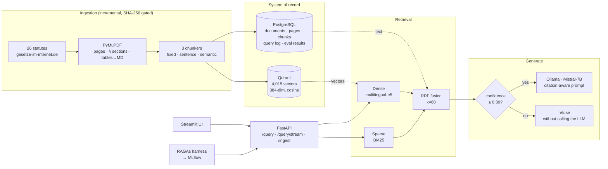

# RAGBuilder — Retrieval-Augmented QA over German Labour Law

[](https://github.com/your-handle/RAGBuilder/actions/workflows/ci.yml)


A production-shaped RAG system over **26 German federal labour statutes**, running
**entirely on local models**. Hybrid retrieval (dense + BM25 fused with Reciprocal Rank
Fusion), citation-grounded generation with an explicit refusal path, and a RAGAs
evaluation harness that measures all of it.

No document and no question ever leaves the machine — which for a German client under
GDPR is the difference between a project that ships and one that dies in a data
protection review.

```bash
docker compose up -d --build && make setup
```

| Service | URL | What it is |
|---|---|---|
| Chat UI | http://localhost:8501 | Streamlit chat with expandable source citations |
| API docs | http://localhost:8000/docs | OpenAPI, auto-generated |
| Qdrant | http://localhost:6333/dashboard | Vector store |
| MLflow | http://localhost:5001 | Evaluation experiment tracking |

---

## Table of contents

- [Architecture](#architecture)
- [Measured results](#measured-results)
- [Quick start](#quick-start)
- [How retrieval works](#how-retrieval-works)
- [Grounding and refusal](#grounding-and-refusal)
- [Evaluation](#evaluation)
- [The corpus](#the-corpus)
- [API](#api)
- [Testing](#testing)
- [CI/CD](#cicd)
- [Interview questions this project answers](#interview-questions-this-project-answers)
- [Repository layout](#repository-layout)
- [Troubleshooting](#troubleshooting)

---

## Architecture


```mermaid
flowchart LR
    subgraph Ingest["Ingestion (incremental, SHA-256 gated)"]
        PDF["26 statutes<br/>gesetze-im-internet.de"]
        PARSE["PyMuPDF<br/>pages · § sections · tables→MD"]
        CHUNK["3 chunkers<br/>fixed · sentence · semantic"]
    end

    subgraph Store["System of record"]
        PG[("PostgreSQL<br/>documents · pages · chunks<br/>query log · eval results")]
        QD[("Qdrant<br/>4,015 vectors<br/>384-dim, cosine")]
    end

    subgraph Retrieve["Retrieval"]
        DENSE["Dense<br/>multilingual-e5"]
        BM25["Sparse<br/>BM25"]
        RRF["RRF fusion<br/>k=60"]
    end

    subgraph Generate
        GUARD{"confidence<br/>≥ 0.30?"}
        LLM["Ollama · Mistral-7B<br/>citation-aware prompt"]
        REFUSE["refuse<br/>without calling the LLM"]
    end

    UI["Streamlit UI"]
    API["FastAPI<br/>/query · /query/stream · /ingest"]
    EVAL["RAGAs harness<br/>→ MLflow"]

    PDF --> PARSE --> CHUNK --> PG
    CHUNK --> QD
    UI --> API --> DENSE & BM25
    DENSE & BM25 --> RRF --> GUARD
    GUARD -->|yes| LLM
    GUARD -->|no| REFUSE
    PG -.text.-> RRF
    QD -.vectors.-> DENSE
    EVAL --> API
```

**PostgreSQL is the system of record; Qdrant is derived state.** Changing the embedding
model or the chunking strategy means dropping the collection and rebuilding it — which
must not mean re-parsing 26 PDFs. The vector payload carries a 300-character preview for
rendering a citation without a round trip, and nothing more.

---

## Measured results

Measured on a 10-core / 16 GB laptop, CPU only, with the whole stack in Docker and
Ollama on the host. Corpus: 26 statutes, 478 pages, 4,015 chunks across three strategies.

### Retrieval quality — the headline experiment

22 questions, 20 with a known correct statute. **Hit rate** = the expected statute
appeared in the top 5. Reproduce with `make evaluate-fast`.

| Chunking | Retrieval | Hit rate | Refusal accuracy | Avg confidence | Avg latency |
|---|---|---:|---:|---:|---:|
| fixed | dense | 0.900 | 0.909 | 0.710 | 1,529 ms |
| fixed | sparse | 0.900 | 0.818 | 0.501 | **14 ms** |
| fixed | **hybrid** | **0.950** | 0.909 | 0.734 | 183 ms |
| sentence | dense | 0.900 | 0.909 | 0.719 | 179 ms |
| sentence | sparse | 0.900 | 0.818 | 0.502 | **15 ms** |
| sentence | **hybrid** | **0.950** | 0.909 | 0.744 | 230 ms |
| semantic | dense | 0.900 | 0.909 | 0.722 | 196 ms |
| semantic | sparse | 0.900 | 0.818 | 0.504 | **14 ms** |
| semantic | **hybrid** | **0.950** | 0.909 | **0.745** | 253 ms |

**What this actually shows:**

1. **Hybrid beats either retriever alone, in every single strategy** — 0.950 vs 0.900.
   That is the central claim of the design, and it holds across all three chunkings
   rather than being an artefact of one.
2. **Chunking strategy barely moves retrieval.** All three land on the same hit rate.
   Semantic chunking costs ~7 minutes of extra ingestion (it embeds every sentence
   *before* chunking) and buys 0.001 of confidence. On a corpus this uniformly
   structured, **sentence chunking is the right default** — the honest finding, not the
   one the design predicted.
3. **BM25 is ~13× faster than dense and just as accurate here**, because statutory
   questions are keyword-dense. It loses on paraphrase, which is why fusion wins.

### Answer quality — RAGAs metrics, and how to read them

22 questions, `sentence` chunking, `hybrid` retrieval, Mistral-7B generating and
judging. Reproduce with `make evaluate` (~80 minutes on CPU).

| Metric | Score | What it means here |
|---|---:|---|
| `retrieval_hit_rate` | **0.950** | The right statute was in the top 5 for 19 of 20 answerable questions |
| `refusal_accuracy` | **1.000** | Refused both out-of-corpus questions, answered all 20 answerable ones |
| `citation_rate` | **1.000** | Every answer carried at least one `[n]` marker |
| `answer_relevancy` | **0.907** | Answers address the question that was asked |
| `context_recall` | **0.744** | The retrieved context could support ~3/4 of each reference answer |
| `context_precision` | **0.170** | ← read the arithmetic below before reacting |
| `faithfulness` | **0.389** | ← and the caveat below |
| Avg latency | 77.9 s | Generation on CPU dominates; retrieval is 0.2 s of it |

**`context_precision` of 0.17 is close to its ceiling, not a failure.** The metric
is precision@k: of the `k` retrieved chunks, how many are useful. Almost every
question here is answered by *exactly one* paragraph of *one* statute, and `k=5`.
So the arithmetic maximum is **1/5 = 0.20**, and 0.170 is 85 % of that. The number
is a property of the retrieval budget, not of the retriever. Dropping to `k=2`
would roughly double it while making recall worse — which is why
`retrieval_hit_rate` is the metric this project tunes against and
`context_precision` is reported alongside it rather than instead of it.

**`faithfulness` of 0.389 is mostly a statement about the judge.** Faithfulness
asks a 7B model to decide whether each extracted claim is entailed by the
context. Mistral-7B is a weak entailment judge: it marks a claim unsupported when
the context *implies* rather than *states* it, which German statutory language
does constantly (`§ 3` gives the number, `§ 4` gives the waiting period, and an
answer that combines them reads as unsupported to a literal-minded judge). Spot-
checking the low scorers confirms this — `q02` and `q07` scored 0.00 on answers
that are factually correct and correctly cited.

The honest position: **relative comparisons between configurations are the
signal; the absolute faithfulness number is not trustworthy at this judge size.**
Fixing it means a stronger judge (GPT-4-class, or a dedicated NLI model like
`microsoft/deberta-v3-large-mnli`), which reintroduces either an API dependency
or a second model to host — the trade-off is documented in
[DESIGN.md § 9](DESIGN.md#9-evaluation-ragas-metrics-local-judge).

That `refusal_accuracy` and `citation_rate` are both 1.000 is the result worth
leading with: the system never invented an answer to a question its corpus could
not support, and never made an uncited claim.

### Cross-lingual retrieval: the embedding model matters more than the chunker

The same question asked in German and English against three German passages, one
correct. Reproduce with `docker compose exec api python scripts/ab_embedding_models.py`.

| Model | German query | English query |
|---|---|---|
| `multilingual-e5-small` (384d) | ✅ correct (0.905) | ❌ **wrong** (0.821 vs 0.804) |
| `multilingual-e5-large` (1024d) | ✅ correct (0.902) | ✅ **correct** (0.806) |

This is the concrete cost of the `-small` default. Both models handle German→German
fine; only `-large` handles English→German. If your users ask in a different language
from the corpus, **pay for the large model** — it is worth far more than any chunking
tweak.

### Throughput

| Stage | Result |
|---|---:|
| Download 26 statutes | 14 s |
| Parse + chunk, 3 strategies (4,015 chunks, 478 pages) | 430 s |
| Embed 4,015 chunks — `e5-small` | 4.0 chunks/s |
| Embed 1,385 chunks — `e5-large` | **< 0.5 chunks/s** (still running at 35 min) |
| Retrieval, hybrid (BM25 index warm) | 180–250 ms |
| Generation, Mistral-7B on CPU | 0.5–7 tok/s, 35–70 s per answer |
| BM25 index build (1,385 chunks, 12,095 tokens) | 0.20 s |

Generation is the bottleneck by two orders of magnitude, which is why the API streams
and why the refusal guard runs *before* the model is called.

---

## Quick start

**Prerequisites:** Docker Desktop (~6 GB), and [Ollama](https://ollama.com) running on
the host with a model pulled:

```bash
ollama pull mistral
```

Then:

```bash
git clone https://github.com/your-handle/RAGBuilder.git
cd RAGBuilder
cp .env.example .env          # optional - every value has a default

make up                       # postgres + qdrant + mlflow + api + ui
make setup                    # download 26 statutes, parse, chunk, embed  (~12 min)
```

Open http://localhost:8501 and ask *"Wie viele Urlaubstage stehen mir mindestens zu?"*

```bash
make health          # component-level status
make stats           # chunk counts per strategy, vector store, documents
make ask Q="Ab wann gilt der Kündigungsschutz?"
make search Q="§ 3 Mindesturlaub"       # retrieval only, no generation
make evaluate-fast   # the retrieval grid above, ~2 minutes
make evaluate        # full RAGAs scoring - slow, see below
make clean           # stop and delete all data
```

---

## How retrieval works

### Why hybrid

The two retrievers fail in **uncorrelated** ways, which is the only reason combining
them helps:

| Query | Dense alone | BM25 alone |
|---|---|---|
| `§ 3 Mindesturlaub` | returns a *semantically similar* paragraph about leave — plausible, wrong | exact match, rank 1 |
| *"Wie lange habe ich frei?"* | finds `Der Urlaub beträgt jährlich mindestens 24 Werktage` | thin keyword overlap |

The BM25 tokenizer deliberately keeps `§` and digits, because in a statutory corpus
those are the highest-signal tokens in the query — and the ones an embedding model
blurs together (`§ 622` and `§ 623` are near-identical vectors).

### Why Reciprocal Rank Fusion, not score merging

```
score(d) = Σ over retrievers  1 / (k + rank(d))        k = 60
```

A cosine similarity of 0.83 and a BM25 score of 14.2 are not comparable. Every
normalisation scheme (min-max, z-score) makes the weighting depend on the score spread
of the *particular query*, so the balance between retrievers silently changes from
question to question. RRF uses **rank only** — the robust statistic — and rewards
agreement: a chunk ranked 3rd by both retrievers outranks one ranked 1st by a single
retriever and missed by the other.

That property is pinned by a test:

```python
def test_agreement_beats_a_single_first_place(self):
    fused = dict(reciprocal_rank_fusion([["a", "b"], ["c", "b"]], k=60))
    assert fused["b"] > fused["a"]
```

### Query expansion is rule-based on purpose

Expansion runs on the latency path of *every* question. A 2-second LLM call to rephrase
is a poor trade against the recall it buys. The variants that matter for this corpus are
cheap and deterministic:

| Input | Expansions |
|---|---|
| `Wie lange ist die Kündigungsfrist?` | `die Kündigungsfrist` · `kündigungsfrist` |
| `Was steht in Paragraf 622 Absatz 2?` | `Was steht in § 622 abs. 2?` · `622 abs 2` |

Stripping the interrogative frame makes the query look more like the statutory text it
should match.

---

## Grounding and refusal

Three layers, in order of how much they can be trusted:

**1. A hard confidence gate (deterministic).** Below `rag.min_confidence` the chain
returns a refusal and *never calls the LLM*. There is no prompt wording that reliably
stops a 7B model from inventing an answer when the context is thin, so the guard belongs
where it cannot be talked out of it.

**2. The system prompt (mitigation).** Answer only from context · cite every claim ·
quote the paragraph identifier · ignore irrelevant sources rather than refusing · state
the general rule then the exception · refuse only when no source applies.

That fifth rule was added because of a real failure. Asked *"Wie viele Urlaubstage stehen
mir mindestens zu?"*, the model retrieved the correct § 3 BUrlG **and** the youth-worker
rules in § 19 JArbSchG, saw two different numbers, and refused. It now answers:

> Ihr Anspruchsberechtigter erhält mindestens 24 Werktage Urlaub pro Jahr [1, § 3 Abs. 1].
> […] Jugendliche erhalten mindestens 30 Werktage Urlaub pro Jahr, wenn sie noch nicht
> 16 Jahre alt sind [4, § 19 Abs. 2].

**3. Citation verification (observability).** Every answer is parsed for `[n]` markers
and each source is flagged cited or merely retrieved, so an uncited claim is *visible*
rather than assumed. The parser handles `[1]`, `[1][2]`, `[1, 2]` and `[1, § 3 Abs. 1]` —
taking only the leading number, because harvesting every integer would invent a citation
to source 3 from the text "§ 3".

**Prompt injection.** Retrieved context is untrusted input once users can upload PDFs.
Context is wrapped in `<context>` delimiters and the system prompt states that anything
inside resembling an instruction is quoted text. This is defence in depth, not a
solution — the real containment is that the generation path has no tools and no outbound
network access.

---

## Evaluation

Four RAGAs metrics, implemented against the **local** judge model rather than importing
the `ragas` package — which defaults to OpenAI, and sending this corpus to a third-party
API to measure a system whose premise is that data stays local would be incoherent.

| Metric | Measures | Needs |
|---|---|---|
| `faithfulness` | fraction of the answer's claims the context supports (hallucination rate, inverted) | judge |
| `answer_relevancy` | similarity between the real question and one reconstructed from the answer | judge + embeddings |
| `context_precision` | fraction of retrieved chunks that are actually useful — grades the *retriever* | judge |
| `context_recall` | fraction of the reference answer the context could support | judge + ground truth |
| `refusal_accuracy` * | refused the unanswerable **and** answered the answerable | — |
| `citation_rate` * | fraction of answers carrying at least one `[n]` | — |

\* not RAGAs metrics; added because a system that refuses everything scores perfectly on
faithfulness and is useless.

**A 7B judge is a weak judge, and the code says so.** Unparseable verdicts are counted as
undecided and *excluded* from the average rather than scored zero — otherwise a flaky
judge looks like a hallucinating system. Treat the relative comparison between strategies
as the signal and the absolute values with suspicion.

```bash
make evaluate-fast   # retrieval only, no generation - 2 minutes, the grid above
make evaluate        # full scoring - ~3 min/question on CPU
```

`--retrieval-only` exists because generation is ~40 s per question and retrieval is
~0.2 s. Tuning chunk size, fusion weights or expansion against the full grid is a
two-minute loop instead of an hour, and `retrieval_hit_rate` is the metric that actually
moves when you change them.

Every run is logged to MLflow with the full parameter set (embedding model, LLM, top-k,
RRF k, expansion on/off, confidence threshold) plus per-sample verdicts as an artifact.

---

## The corpus

26 federal statutes from **gesetze-im-internet.de**, the Federal Ministry of Justice's
official publication service — free of copyright under § 5 UrhG.

`KSchG` · `ArbZG` · `BUrlG` · `TzBfG` · `EntgFG` · `MuSchG` · `BEEG` · `AGG` · `BetrVG` ·
`ArbSchG` · `MiLoG` · `NachwG` · `BBiG` · `JArbSchG` · `PflegeZG` · `FPfZG` · `ArbnErfG` ·
`AÜG` · `TVG` · `ArbGG` · `BetrAVG` · `BDSG` · `SchwarzArbG` · `BPersVG` · `ArbPlSchG` ·
`GeschGehG`

Chosen over annual reports or arXiv papers for three reasons that make it a *harder* and
more revealing test: the text is German while questions may be either language; every
provision is numbered so citations are checkable by hand; and answers are precise
("24 Werktage") so a hallucination is unambiguous rather than a plausible summary.

An English fallback corpus (`arxiv_nlp`) is registered for demos:
`make ingest CORPUS=arxiv_nlp`.

---

## API

```bash
curl -X POST http://localhost:8000/query \
  -H 'Content-Type: application/json' \
  -d '{"question": "Wie viele Urlaubstage stehen mir mindestens zu?"}'
```

```jsonc
{
  "answer": "Jährlich mindestens 24 Werktage [1, § 3 Abs. 1].",
  "sources": [{
    "index": 1,
    "citation": "Bundesurlaubsgesetz, § 3 Dauer des Urlaubs, pp. 1-2",
    "excerpt": "§ 3 Dauer des Urlaubs (1) Der Urlaub beträgt jährlich mindestens 24 Werktage. […]",
    "retriever": "hybrid", "dense_rank": 2, "sparse_rank": 9, "cited": true
  }],
  "confidence": 0.656,
  "refused": false,
  "cited_source_count": 1,
  "retrieval_ms": 231.4,
  "generation_ms": 36912.0
}
```

| Endpoint | Purpose |
|---|---|
| `POST /query` | Answer a question |
| `POST /query/stream` | Same, as SSE — **sources first**, then tokens, so the UI renders citations while the model is still writing |
| `POST /ingest` | Download, parse, chunk, embed (background; ~12 min, far beyond any HTTP timeout) |
| `GET /documents` | Knowledge base contents |
| `GET /health` | Per-component status for PostgreSQL, Qdrant and Ollama |
| `GET /stats` | Chunk counts, vector store state, query volume |

Blocking LLM and embedding calls run in a threadpool rather than pretending to be async —
declaring a handler `async def` and then doing blocking work inside it is the classic way
to stall an event loop. Rate limiting via slowapi, 30/minute by default.

---

## Testing

**213 unit tests** (plus 18 integration), all green. The unit suite needs no stack and
runs in 8 seconds.

| Suite | Tests | Covers |
|---|---:|---|
| `test_prompts.py` | 40 | Grounding/citation/refusal/injection instructions present, context budget, citation parsing edge cases |
| `test_retrieval.py` | 38 | RRF arithmetic (including the agreement property), BM25 tokenisation, query expansion, confidence in all three modes |
| `test_parsing.py` | 32 | § heading detection, page-furniture stripping, table→Markdown, corpus integrity |
| `test_chunking.py` | 30 | All three chunkers: token budgets, exact page attribution, sentence integrity, chunk-id stability and namespacing |
| `test_evaluation.py` | 27 | Metric definitions, undecided-verdict handling, test set integrity |
| `test_config.py` | 24 | Nested config sections, env overrides, type coercion, dimension guards |
| `test_api.py` | 22 | Routing, validation, serialisation, 503 on model failure — chain stubbed |
| `test_integration.py` | 18 | End to end against the running stack |

```bash
make test-unit          # 213 tests, ~8 s
make test-integration   # needs the stack up and the corpus ingested
make lint               # flake8 + black
```

Several of these tests exist because of bugs found while building, and say so in their
docstrings — the sparse-confidence test, the chunk-id namespacing test, and the
citation-parsing tests all pin real regressions.

---

## CI/CD

[`.github/workflows/ci.yml`](.github/workflows/ci.yml) — five jobs:

1. **lint** — flake8 + black
2. **unit-tests** — pytest with coverage, CPU-only torch
3. **config** — `config.yaml` has every section; the test set has ≥20 questions, unique
   ids, both languages, and at least one unanswerable question
4. **docker-build** — buildx with layer cache; the built image must import the app and
   pass its own tests
5. **integration** — real PostgreSQL and Qdrant services, ingests a slice of the corpus,
   embeds it, and asserts hybrid retrieval returns the right statute

---

## Interview questions this project answers

**"How did you evaluate whether your RAG system was hallucinating?"**
Faithfulness: decompose each answer into claims, ask the judge whether the retrieved
context supports each one, report the supported fraction. Per-claim verdicts are kept, so
an unsupported claim is inspectable rather than a number.

**"Why Qdrant over Pinecone or Chroma?"**
Self-hosted (the premise of the whole stack), and filters applied *inside* the HNSW
traversal rather than as a post-filter over the top-k — so restricting a search to one
statute still returns `k` results. pgvector was the genuinely tempting alternative; it
would remove a service at the cost of HNSW tuning and in-traversal filtering.

**"What is RRF and why is it better than merging results?"**
See [above](#why-reciprocal-rank-fusion-not-score-merging) — the short version is that
scores from different retrievers are not comparable and every normalisation makes the
weighting query-dependent.

**"Semantic vs fixed chunking — when would you use each?"**
On this corpus, measured: **no meaningful difference in retrieval hit rate**, and semantic
costs 7 extra minutes of ingestion. Fixed chunking's real failure is structural — it cuts
mid-provision, so the retrieved fragment reads as authoritative and is incomplete. Use
sentence-aware by default; fixed when sentence boundaries are unreliable (OCR,
transcripts); semantic when documents genuinely change topic mid-section.

**"How would you scale this to 10 million documents?"**
Distributed Qdrant with sharding; move BM25 out of memory into PostgreSQL FTS or
Elasticsearch; batch embedding on GPU (CPU is 4 chunks/s — the binding constraint);
and add a cross-encoder reranker over the top 20, which would likely beat any further
fusion tuning.

**"What would you do differently?"** See
[DESIGN.md § Known limitations](DESIGN.md#known-limitations) — the judge is the weakest
link, BM25 is in memory, there is no reranker, confidence is heuristic rather than
calibrated, and conversation memory does not rewrite the retrieval query.

---

## Repository layout

```
RAGBuilder/
├── ragbuilder/
│   ├── config.py              # config.yaml + env overlay (no PEP 563 - see the docstring)
│   ├── db.py                  # PostgreSQL access, explicit SQL
│   ├── ingestion/
│   │   ├── corpora.py         #   26 statutes + arXiv fallback
│   │   ├── parser.py          #   PyMuPDF: pages, § sections, tables→Markdown
│   │   └── pipeline.py        #   incremental, SHA-256 gated
│   ├── chunking/
│   │   ├── base.py            #   Chunk, tokens, sentence splitting, page mapping
│   │   └── strategies.py      #   fixed · sentence · semantic + registry
│   ├── embeddings/
│   │   ├── encoder.py         #   e5 with the query:/passage: prefixes baked in
│   │   ├── store.py           #   Qdrant, incl. pruning orphaned vectors
│   │   └── pipeline.py        #   batched, resumable
│   ├── retrieval/
│   │   ├── sparse.py          #   BM25, § -preserving tokenizer
│   │   ├── fusion.py          #   Reciprocal Rank Fusion
│   │   └── retriever.py       #   dense/sparse/hybrid + expansion + confidence
│   ├── llm/
│   │   ├── client.py          #   Ollama, streaming, model fallback
│   │   └── prompts.py         #   system prompt, citation parsing, refusal detection
│   ├── rag/chain.py           # retrieve → guard → generate → attribute
│   ├── evaluation/
│   │   ├── metrics.py         #   RAGAs definitions against a local judge
│   │   ├── testset.json       #   22 questions, 2 deliberately unanswerable
│   │   └── runner.py          #   grid runner + MLflow logging
│   └── api/                   # FastAPI + Pydantic models
├── ui/app.py                  # Streamlit chat client
├── scripts/ab_embedding_models.py   # the cross-lingual A/B above
├── sql/schema.sql             # 7 tables, 2 views
├── tests/                     # 213 unit + 18 integration tests
├── DESIGN.md                  # every decision + what would make the other choice right
└── docker-compose.yml
```

---

## Troubleshooting

| Symptom | Cause / fix |
|---|---|
| `/health` shows ollama **down** | Ollama runs on the *host*. `ollama serve`, then `ollama pull mistral` |
| Answers take 40–70 s | Expected: 7B on CPU. Use a smaller model (`LLM_MODEL=qwen2.5-coder:7b`) or a GPU host |
| Embedding takes forever | You are on `e5-large`. `EMBEDDING_MODEL=intfloat/multilingual-e5-small make reset-vectors` |
| `collection has N dimensions but the model produces M` | Model changed without rebuilding. `make reset-vectors` |
| Retrieval returns text that looks truncated at 300 chars | Orphaned vectors whose chunk was deleted. `make embed` prunes them automatically |
| English questions retrieve the wrong statute | Known limitation of `e5-small` — see [the A/B above](#cross-lingual-retrieval-the-embedding-model-matters-more-than-the-chunker) |
| Port 5000 already in use | macOS AirPlay Receiver. MLflow is mapped to **5001** |

---

## License

MIT. The statutes themselves are public domain under § 5 UrhG.
